# Lab1：Back-propagation  by Chiang Tzu-Hao std id:309551116

## 1 - Introduction ##
In this lab assignment, we need to implement a neural network(NN) and
backpropagation.
Lab request:
- Only use Numpy and other Python standard library without framework (e.g. Tensorflow, PyTorch) to build a simple neural networks.
- Simple neural networks has two hidden layers.
- Plot the comparison figure between prediction and ground-truth

### 1.1 Package ###
- numpy : fundamental package for scientific computing with Python.
- matplotlib.pyplot : a library for plotting graphs in Python.


```python
# package import
import numpy as np
import matplotlib.pyplot as plt

np.random.seed(1) # set a seed so that the results are consistent
```

### 1.2 Data Sets ###
- Linear Data
- XOR Data
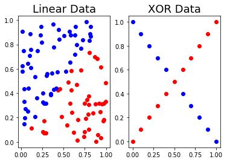

### 1.3 Implementation parameters ###
- $x_{1}, x_{2}$ : nerual network inputs
- $X : [x_{1}, x_{2}]$
- $y$ : nerual network outputs
- $\hat{y}$ : ground truth
- $L(\theta)$ : loss function
- $W_{1}, W_{2}, W_{3}$ : weight matrix o network layers
- $\alpha$ : Learning rate (0.05 for Linear Data, 10 for XOR Data)

## 2 - Experiment setups ##
### 2.1 Activation function $\sigma$ (sigmoid) : ###
$$\sigma(x) = \frac{1}{1 + e^{-x}}$$

$$\sigma'(x) = \sigma(x) (1 - \sigma(x))$$
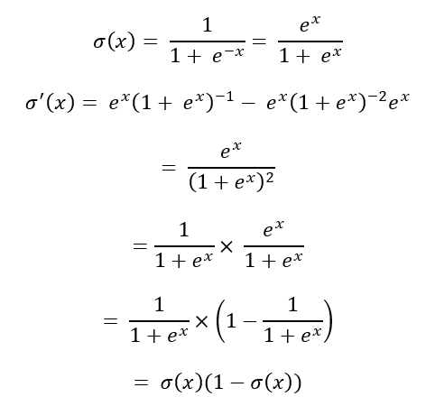


```python
def sigmoid(x):
    return 1.0 / (1.0 + np.exp(-x))
```


```python
def derivative_sigmoid(y):
    return np.multiply(y, 1.0 - y)
```

### 2.1 Loss function $L(\theta)$ : ###
$$ L(\theta) = \frac{1}{m} (y - \hat{y})^{2} $$
$$ L'(\theta) = \frac{2}{m} (\hat{y} - y) $$


```python
def Loss(y_hat, y):
    """
    using mean square error
    
    Arguments:
    y_hat -- the probability of our label prediction
    y -- ground-truth label
    
    Returns:
    loss -- mean square error
    """
    
    m = y.shape[0]
    
    loss = 1/m * np.sum((y-y_hat) *(y-y_hat))
    
    return loss
```

### 2.2 Neural network ###
1. Parameters : 
    - Inputs : 2 input units
    - Hidden 1 Layer : 4 hidden units
    - Hidden 2 Layer : 4 hidden units
    - Output : 1 output units
    - number o steps : 10000
    - learning rate : 0.05 for Linear Data, 10 for XOR Data
    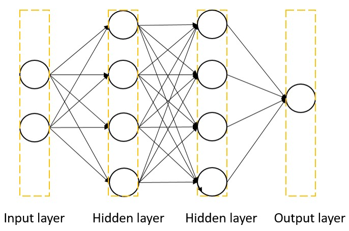

2. Neural unit :
    The input X vector get output y vector through neural unit:
    $$X_{i} = X_{i-1} W_{i}$$
    $$Z_{i} = \sigma(X_{i})$$
    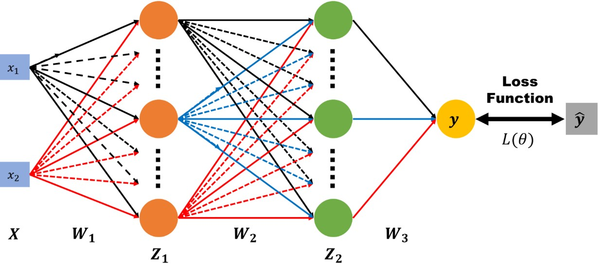
    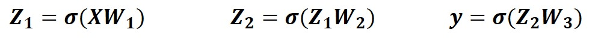


### 2.3 Backward Propagation ###
At first , all parameters of weight are randomly initialized.
During training , we use gradient descent to update our network’s weights.

1. $$\frac{\partial L}{\partial \hat{y}} = L'(\hat{y}, y) = \frac{2}{m} (\hat{y} - y) $$
2. $$\frac{\partial \hat{y}}{\partial X_{3}} = \sigma'(\hat{y}) $$
3. $$dX_{3} = \frac{\partial L}{\partial X_{3}} = \frac{\partial L}{\partial \hat{y}} \frac{\partial \hat{y}}{\partial X_{3}} = \frac{2}{m} (\hat{y} - y ) .* \sigma'(\hat{y}) $$
4. $$dW_{3} = \frac{\partial L}{\partial W_{3}} = \frac{\partial X_{3}}{\partial W_{3}}^{T} \frac{\partial L}{\partial X_{3}} = \frac{2}{m} Z_{2}^{T} dX_{3}$$
5. $$dX_{2} = \frac{\partial L}{\partial X_{2}} = \frac{\partial L}{\partial X_{3}} \frac{\partial X_{3}}{\partial Z_{2}} \frac{\partial Z_{2}}{\partial X_{2}} = \frac{2}{m} dX_{3} W_{3}^{T} .* \sigma'(Z_{2}) $$
6. $$dW_{2} = \frac{\partial L}{\partial W_{2}} = \frac{\partial X_{2}}{\partial W_{2}}^{T} \frac{\partial L}{\partial X_{2}} = \frac{2}{m} Z_{1}^{T} dX_{2} $$
7. $$dX_{1} = \frac{\partial L}{\partial X_{1}} = \frac{\partial L}{\partial X_{2}} \frac{\partial X_{2}}{\partial Z_{1}} \frac{\partial Z_{1}}{\partial X_{1}} = \frac{2}{m} dX_{2} W_{2}^{T} .* \sigma'(Z_{1}) $$
8. $$dW_{1} = \frac{\partial L}{\partial W_{1}} = \frac{\partial X_{1}}{\partial W_{1}}^{T} \frac{\partial L}{\partial X_{1}} = \frac{2}{m} X^{T} dX_{1} $$
**Then we update our weights by following three equation:**
$$W_{2} = W_{1} - \alpha * dW_{1} \tag{1}$$
$$W_{2} = W_{2} - \alpha * dW_{2} \tag{2}$$
$$W_{3} = W_{3} - \alpha * dW_{3} \tag{3}$$

## 3 - Experiment Results ##
### 3.1 Linear Data ###
1. Screenshot (accuracy and my prediction)
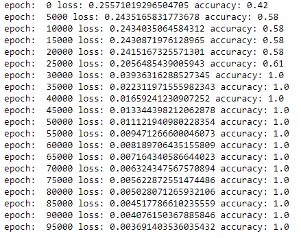
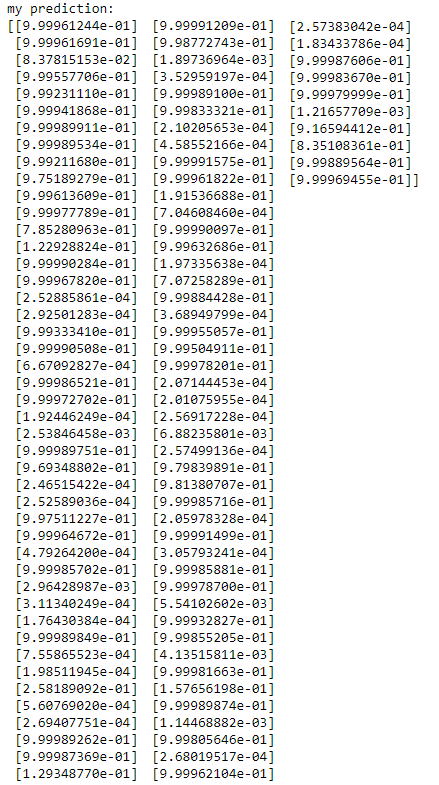
2. Comparison figure

3. Learning curve
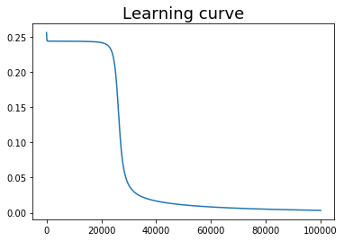


### 3.2 XOR Data ###
1. Screenshot (accuracy and my prediction)
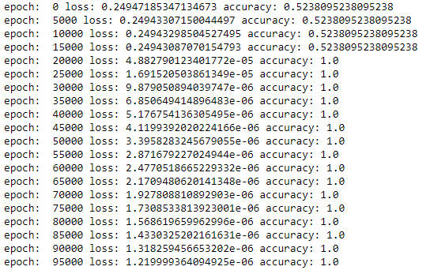
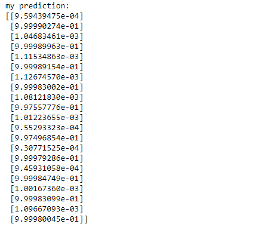
2. Comparison figure
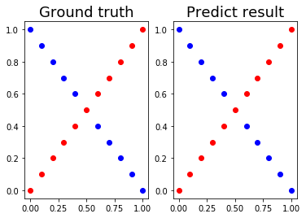
3. Learning curve
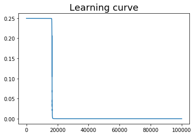

## 4 - Disscussion ##
### 4.1 Different learning rate ###
1. Linear Data
    - I try learning rate = 0.01, 0.03, 0.05, 0.07, 0.1, 0.3, 0.5, 0.7, 1
    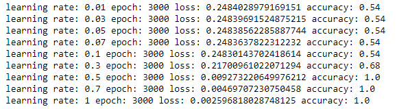
    - Loss with different learning rate
    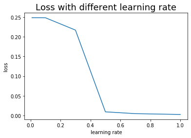
    - Accuracy with different learning rate
    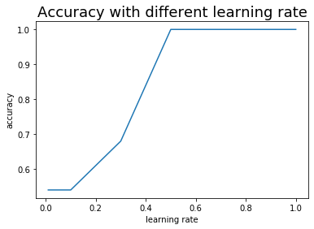

    **we can see that when we increase the learning rate, we can get high accuracy and low loss more quickly.**

2. XOR Data
    - I try learning rate = 0.01, 0.05, 0.1, 0.5, 1, 3, 5, 7, 9
    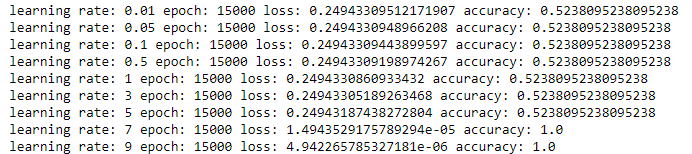
    - Loss with different learning rate
    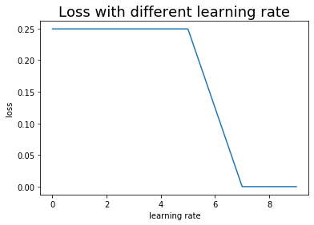
    - Accuracy with different learning rate
    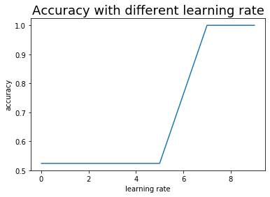

    **we can see that when we increase the learning rate, we can get high accuracy and low loss more quickly.**

### 4.2 Different numbers of hidden units ###
1. Linear Data
    - I try numbers of hidden unit = 2, 4, 6, 8, 10, learning rate = 0.05
    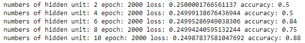
    - Loss with different learning rate
    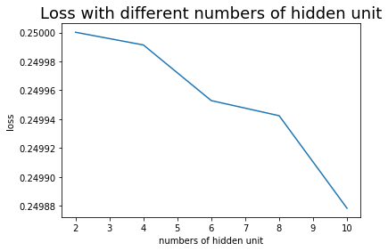
    - Accuracy with different learning rate
    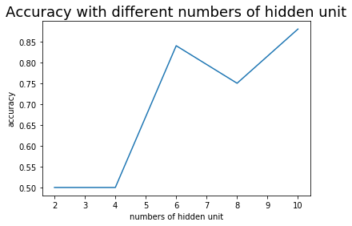

    **we can see that when we increase the numbers of hidden unit, accuracy tends to increase.**

2. XOR Data
    - I try numbers of hidden unit = 1, 2, 3, 4, 5, 6, 7, 8, 9, 10, learning rate = 6
    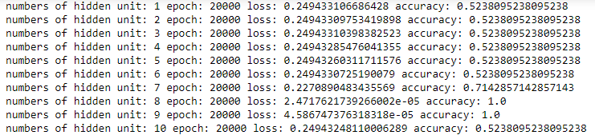
    - Loss with different learning rate
    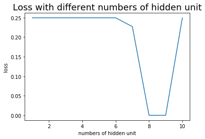
    - Accuracy with different learning rate
    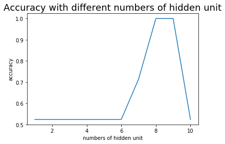

    **we can see that when we increase the numbers of hidden unit, accuracy tends to increase.**
    **But it will fall when we still increase.**
    **But I think it is not voerfitting, since when I increase the traing step to 30000 the accuracy become 1.0**
    **So I think it just need more training step or the gradient exploding.**
    
    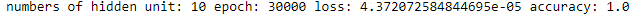
    

### 4.3 Without sigmoid function ###
1. Linear Data : (4 hidden units, learning rate = 0.05)
    - Without sigmoid function, if we want the output close to 0 and 1, then the weights need to be very small.
    - Moreover, the gradient will be too small that the loss would not change.
    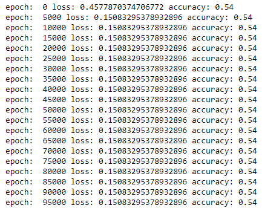
    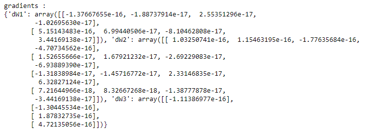
    - So I try larger learning rate. But the loss will become NAN at the begining of the training
    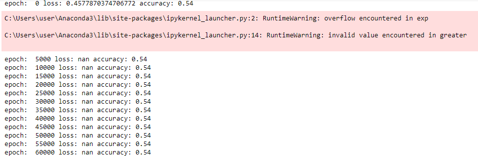


2. XOR Dara : (4 hidden units, learning rate = 10)
    - Without sigmoid function, the loss will become NAN at the begining of the training.
    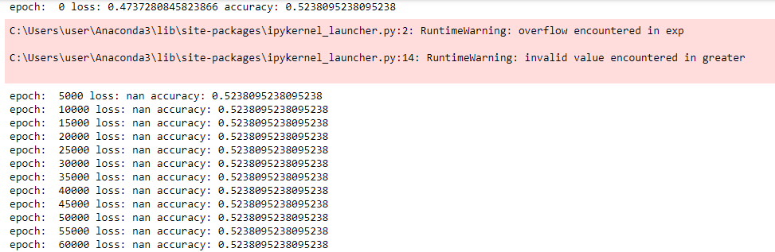
    - So I try smaller learning rate = 1. Then it can works but the accuracy is poor.
    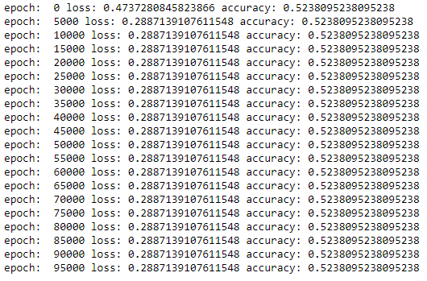
